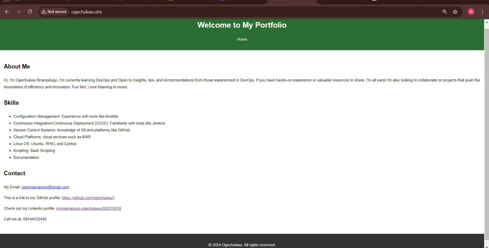

## CAPSTONE PROJECT 50

- Deploy your portfolio project on aws, use any aws tools of your choice - S3 or EC2

- For your website: showcase your skills and contact link on domain.

- Attach a domain to your website


__Using AWS S3 for Static Website hosting__


- Create an S3 Bucket: Ensure the bucket name matches your domain name (e.g., `ogechukwu.site`).

- Go to the S3 console.

- Click "Create bucket".

- Enter the bucket name and configure the settings.

- Click "Create bucket".

- Upload Your Website Files (index.html, style.CSS, script.js, etc.) to the bucket.

- Enable Static Website Hosting

- Select your bucket.

- Go to the "Properties" tab.

- Enable "Static website hosting" and set the index and error documents (e.g., index.html, error.html).

- Configure S3 Bucket Policy for Public Access


- Go to the "Permissions" tab of your bucket.

- Under "Bucket policy", add the following JSON policy and save the policy.  These policies are used to control what actions are allowed or denied for those entities within your AWS environment.

__Key Components of a JSON Policy__

__Version__: Specifies the language current version of the policy. 

__Statement:__ Contains a single statement, Each statement has several components:

- Effect: Specifies whether the statement allows or denies access. It can be "Allow" or "Deny".

- Action: Specifies the AWS service actions that are allowed or denied (eg., "s3", "ec2").

- Resource: Specifies the bucket ("arn:aws:s3:::example-bucket") and all objects within the bucket ("arn:aws:s3:::example-bucket/*").


```
{
  "Version": "2012-10-17",
  "Statement": [
    {
      "Sid": "PublicReadGetObject",
      "Effect": "Allow",
      "Principal": "*",
      "Action": "s3:GetObject",
      "Resource": "arn:aws:s3:::ogechukwu.site/*"
    }
  ]
}

```


__Point Your Domain to AWS S3 Using Route 53__


- Go to the Route 53 console.

- Click "Create hosted zone".

- Enter your domain name and click "Create".

- Get Nameservers from Route 53:


__Update Nameservers in your domain__

- Log in to your domain account.

- Go to "Domain List" and click "Manage" next to your domain.

- Under the "Nameservers" section, select "Custom DNS".

- Enter the nameservers provided by Route 53 and save the changes.


__Create Alias Record in Route 53__

- Go to your hosted zone in Route 53.

- Click "Create Record Set".

- Set the "Name" field to your domain name (leave it blank for the root domain) means that you are setting a record for the root domain itself, without any subdomain.

- Choose "A - IPv4 address" for the type.

- Set "Alias" to "Yes".

- Click "Alias Target" and select your S3 bucket endpoint and click "create".


__Test your domain__ 





