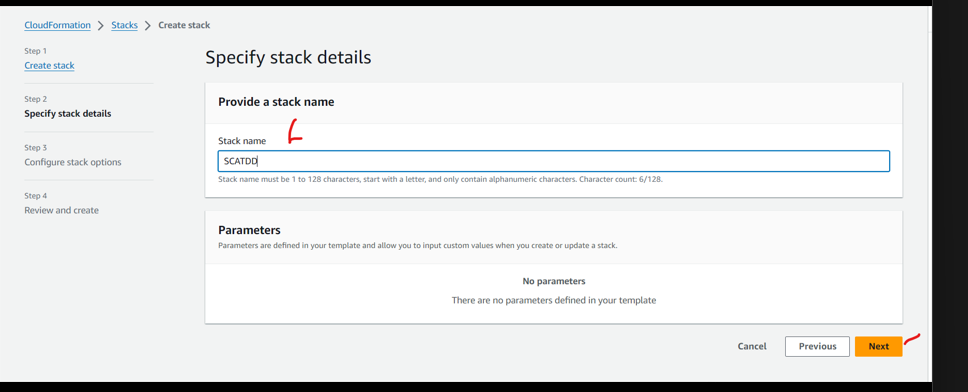
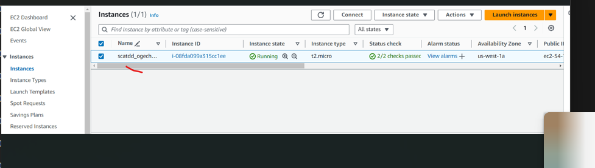

__TERMINOLOGIES IN CLOUDFORMATIONS__

- __TEMPLATES__: Are the text files or the script of cloud formation, but not scripts in programming language. You can write them in YAML or JSON format.

Cloud formation will read templates as an input and the output will be resource that will create and maintain the stack

Textfiles- YAML or JSON

Here is an example of an AWS CloudFormation YAML template that creates a simple setup with an EC2 instance and a security group


- Set up LAMP stack webserver using cloudformation. On your webserver Echo "sample web from SCAlagos TDD" created by your name and attendance number.

- Let your webserver instance vpc and other resources be created with the suffix scatdd_your name_xxx.

- Run your webserver and capture the screen, save screen shot on your repo .

- Add readme that explains how to run the script.

- Save your script to github repo and submit to the SCATDD assignment form.


```
AWSTemplateFormatVersion: '2010-09-09'
Description: A simple AWS CloudFormation template to create an EC2 instance with a security group.

Resources:
  MyEC2Instance:
    Type: 'AWS::EC2::Instance'
    Properties:
      InstanceType: t2.micro
      ImageId: ami-0c55b159cbfafe10
      SecurityGroups:
        - Ref: MySecurityGroup
      KeyName: MyKeyPair  

  MySecurityGroup:
    Type: 'AWS::EC2::SecurityGroup'
    Properties:
      GroupDescription: Allow SSH and HTTP access
      SecurityGroupIngress:
        - IpProtocol: tcp
          FromPort: '22'
          ToPort: '22'
          CidrIp: '0.0.0.0/0'
        - IpProtocol: tcp
          FromPort: '80'
          ToPort: '80'
          CidrIp: '0.0.0.0/0'

Outputs:
  InstanceId:
    Description: The Instance ID of the newly created EC2 instance
    Value: !Ref MyEC2Instance
  PublicIP:
    Description: The public IP address of the newly created EC2 instance
    Value: !GetAtt MyEC2Instance.PublicIp
```


__SOLUTION__
 


We'll go to cloudformation service


We will create a directory and name it `cloudformation` then cd into the directory and open in our text sublime editor vscode using `code ..`


Go to `file` and `open folder`


Go to the location where you have the directory and select folder.


Then create a file `example.yaml`


Your templates


To get you `AMI ID`


Create a stack


Choose an existing template, upload a template, choose a file(find your template and upload)


Provide a stack name `SCATDD` and submit




Our stack is completed, and our instance is running





But if our instance doesn't have tag, to give it a tag we'll update our stack and make changes to our template, go to your sublime text(vscode) and create another file and name it `updated.yaml` and give list of tags, give your instance a name `scatdd_ogechukwu_instance`


Our update is complete


Install Necessary Softwares

`sudo yum update -y` 

`sudo yum install httpd php mysql -y`


`sudo systemctl start httpd`: Starts the Apache HTTP server.

`sudo systemctl enable httpd`: Configures Apache to start on boot.

`sudo systemctl status httpd`


create a file in the web root directory  `sudo vi /var/www/html/index.php`

inside the file type `<?php` `phpinfo ();` `?>`


`sample web from scalagos TDD created by ogechukwu_03" > /var/www/html/index.html`


