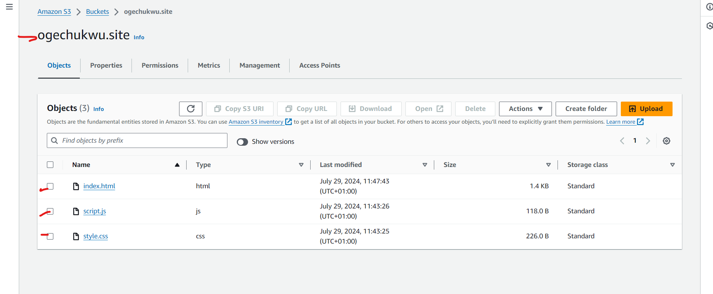
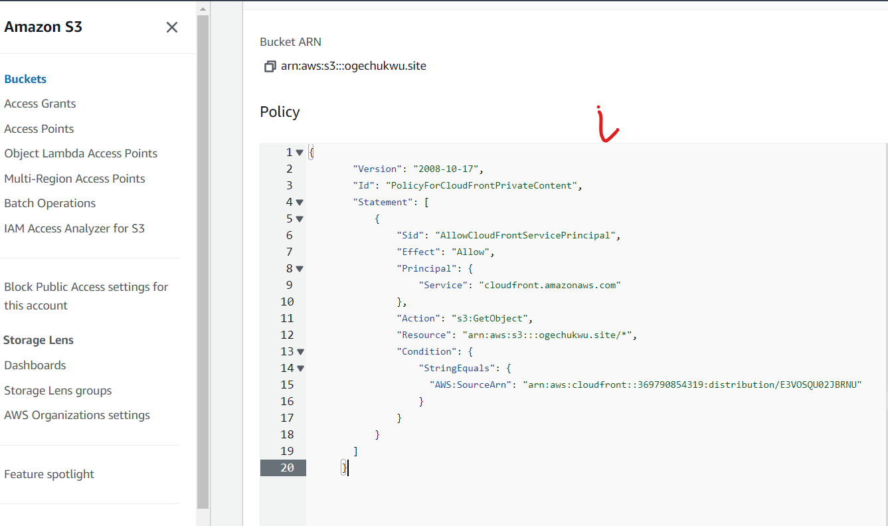
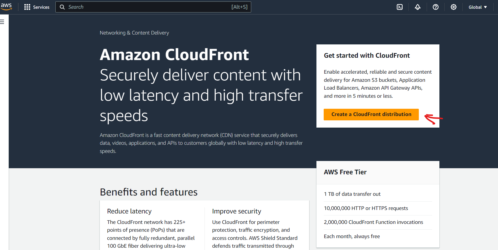
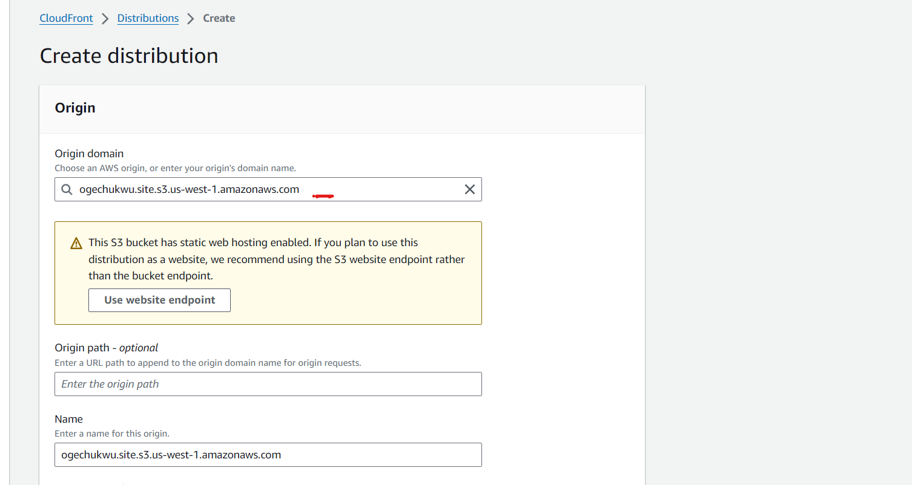
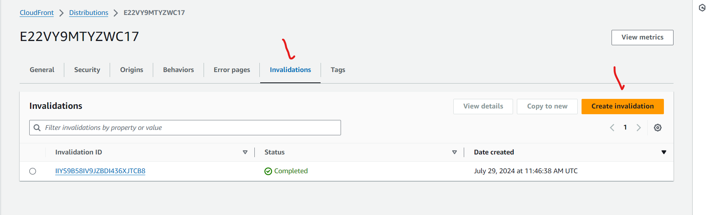
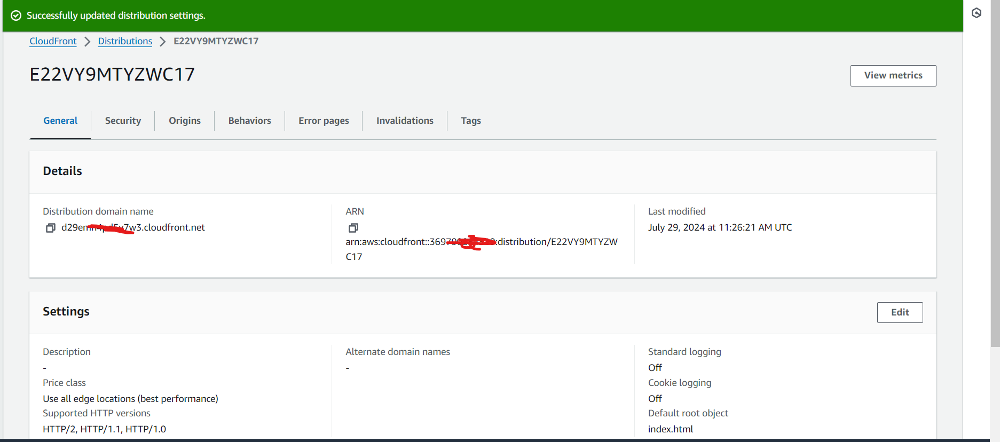
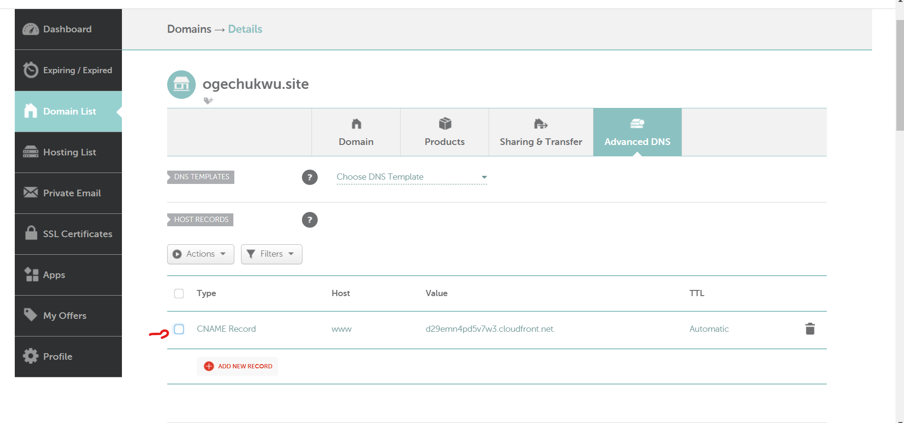

## CLOUDFRONT

Cloudfront is a content delivery network service offered by AWS.

Using Amazon CloudFront, you can ensure fast, secure, and reliable delivery of your content to users worldwide, enhancing their experience and reducing the load on your servers.

- Create an S3 Bucket for Your Website.

- Upload Your Website files(HTML, CSS, JS, etc) to your S3 Bucket.

__Create a CloudFront Distribution__

- Go to the CloudFront console in AWS.

- Click "Create Distribution."

__Configure Distribution Settings:__

- Origin Domain Name: Select your S3 bucket from the list (it will auto-complete).

- Viewer Protocol Policy: Choose between `HTTP and HTTPS` or `Redirect HTTP to HTTPS`.

- Allowed HTTP Methods: Select as required (usually `GET, HEAD`).

- Default Root Object: Set to `index.html`

- Set other settings as needed, such as logging, price class, and geographic restrictions.

__Invalidate CloudFront Cache__

- Invalidate the CloudFront cache to ensure you get the latest version of your files

- In the CloudFront console, select your distribution.

- Go to the Invalidations tab.

- Click on "Create Invalidation".

- Enter /* to invalidate all files and click "Invalidate".

__Update DNS Settings__

After the distribution is created, you'll get a CloudFront domain name (e.g, `d123456abcdef8.cloudfront.net`).

__Update DNS with Namecheap:__

- Log in to your Namecheap account.

- Go to "Domain List" and select "Manage" for your domain `ogechukwu.site`.

- Go to the "Advanced DNS" tab.

- Add a new record

- Type: CNAME 

- Host: www

- Value: Your CloudFront domain name (e.g, `d123456abcdef8.cloudfront.net`)

- TTL: Automatic

__Test Your Website__

- Wait for DNS changes to propagate (this can take a few minutes to several hours).

- Visit www.ogechukwu.site to see your website hosted via CloudFront.

