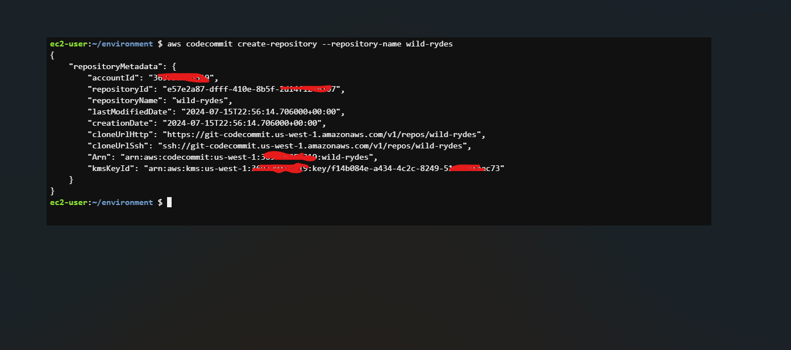
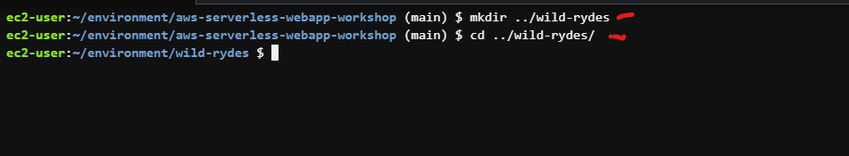

## WILD RYDES WORKSHOP


 In this workshop you’ll deploy a simple web application that enables users to request unicorn rides from the Wild Rydes fleet. The application will present users with an HTML based user interface for indicating the location where they would like to be picked up and will interface on the backend with a RESTful web service to submit the request and dispatch a nearby unicorn. The application will also provide facilities for users to register with the service and log in before requesting rides.

 The application architecture uses [AWS Lambda][lambda], [Amazon API Gateway][api-gw], [Amazon S3][s3], [Amazon DynamoDB][dynamodb], [Amazon Cognito][cognito], and [AWS Amplify Console][amplify-console]. Amplify Console hosts static web resources including HTML, CSS, JavaScript, and image files which are loaded in the user’s browser via S3. JavaScript executed in the browser sends and receives data from a public backend API built using Lambda and API Gateway. Amazon Cognito provides user management and authentication functions to secure the backend API. Finally, DynamoDB provides a persistence layer where data can be stored by the API’s Lambda function.

See the diagram below for a depiction of the complete architecture.


AWS CLOUD9 IDE
AWS Cloud9 is a cloud-based integrated development environment (IDE) that lets you write, run, and debug your code with just a browser. It includes a code editor, debugger, and terminal. Cloud9 comes pre-packaged with essential tools for popular programming languages and the AWS Command Line Interface (CLI) pre-installed so you don’t need to install files or configure your laptop for this workshop.

Your Cloud9 environment will have access to the same AWS resources as the user with which you logged into the AWS Management Console. We strongly recommend using Cloud9 to complete this workshop.

Take a few minutes now and setup your Cloud9 development environment. Cloud9 works best with Chrome or Firefox, not Safari. It cannot be used from a tablet.


__Starting AWS Cloud9__


- Go to the AWS Management Console, Select `Services` then select `Cloud9` under Developer Tools. From the top-right of the Console, select an available region for this workshop. Once you have selected a region for Cloud9, use the same region for the entirety of this workshop.


- Select `Create environment`.


- Enter `wildrydes-webapp-development` into Name and optionally provide a Description.


In Environment settings:

- Set the Instance type to t3.small (2 GiB RAM + 2 vCPU).

- Leave all other defaults unchanged.


- Review the environment settings and select `Create` environment. It will take a few minutes for your Cloud9 environment to be provisioned and prepared.


- Once ready, your IDE will open to a welcome screen. Below that, you should see a terminal prompt. Close the Welcome tab and drag up the terminal window to give yourself more space to work in.


- Keep your AWS Cloud9 IDE opened in a browser tab throughout this workshop.

- Verify that your user is logged in by running the command `aws sts get-caller-identity`. Copy and paste the command into the Cloud9 terminal window.


```
{
    "UserId": "369790854319",
    "Account": "369790854319",
    "Arn": "arn:aws:iam::369790854319:root"
}
```


__STATIC WEB HOSTING__

This section explains the frontend structure. You’ll deploy the static website using AWS Amplify Console by first creating a git repository (in either CodeCommit or GitHub) and then pushing the site code.

In this module you’ll configure AWS Amplify Console to host the static resources for your web application. In subsequent modules you’ll add dynamic functionality to these pages using JavaScript to call remote RESTful APIs built with AWS Lambda and Amazon API Gateway.

__Architecture Overview__

The architecture for this module is very straightforward. All of your static web content including HTML, CSS, JavaScript, images and other files will be managed by AWS Amplify Console and served via Amazon CloudFront. Your end users will then access your site using the public website URL exposed by AWS Amplify Console. You don’t need to run any web servers or use other services in order to make your site available.


__REGION__

This workshop step can be deployed in any AWS region that supports the following services:

- AWS Cognito

- AWS Amplify Console

- AWS CodeCommit


## REPOSITORY

__Create the git repository__

We will use [AWS CodeCommit](https://aws.amazon.com/codecommit/) to host your site’s repository. CodeCommit is included in the [AWS Free Tier](https://aws.amazon.com/free/?all-free-tier.sort-by=item.additionalFields.SortRank&all-free-tier.sort-order=asc&all-free-tier.q=CodeCommit&all-free-tier.q_operator=AND&awsf.Free%20Tier%20Types=*all&awsf.Free%20Tier%20Categories=*all).

CodeCommit helper
The AWS Cloud9 development environment comes with AWS managed temporary credentials that are associated with your IAM user. You use these credentials with the AWS [git-remote-codecommit](https://github.com/aws/git-remote-codecommit) tool (A Git Remote Helper that makes it easier to interact with AWS CodeCommit). This tool is installed in Cloud9 by default. You can install it on your own machine by following the [installation instructions](https://github.com/aws/git-remote-codecommit#set-up).


__Setting up your CodeCommit repository__

- First, create a new CodeCommit repository from within your Cloud9 terminal window:


`aws codecommit create-repository \ --repository-name wild-rydes`




- Clone the existing (not new) workshop repository from GitHub:

`git clone https://github.com/aws-samples/aws-serverless-webapp-workshop.git`


- Change into the workshop repository directory

`cd aws-serverless-webapp-`workshop`


- Install git-subtree if not already installed

`sudo yum install git-subtree -y`


- Split out the `WildRydesVue` code into its own branch

`git subtree split -P resources/code/WildRydesVue -b WildRydesVue`


- Create a new directory for your CodeCommit repository


`mkdir ../wild-rydes`

`cd ../wild-rydes`





- Initialize a new Git repository

`git init`


- Pull the `WildRydesVue` branch into your new repository


`git pull ../aws-serverless-webapp-workshop WildRydesVue`


- Add your CodeCommit repository as a remote


`git remote add origin codecommit://wild-rydes`


- Push the code to your new CodeCommit repository

`git push -u origin master`


- Remove the temporary local repository you created in step 2

`rm -rf ../aws-serverless-webapp-workshop`


## DEPLOY

__Deploy the site with AWS Amplify Console__

Next you’ll use the [AWS Amplify Console](https://aws.amazon.com/amplify/hosting/) to deploy the website you’ve just commited to git. The Amplify Console takes care of the work of setting up a place to store your static web application code and provides a number of helpful capabilities to simplify both the lifecycle of that application as well as enable best practices.

- Launch the [Amplify Console](https://us-west-1.console.aws.amazon.com/amplify/apps)


- Navigate to the AWS Management Console (https://console.aws.amazon.com/).

- In the top-left corner, click on "Services" and then select "Amplify" under "Mobile & Development" or search for "Amplify" in the search bar and select it.


- Connect a repository: Select __AWS CodeCommit__ and choose __Continue__

- From the drop down select the Repository and __master__ Branch created today and select __Next__

-  will detect that the application has an existing Amplify backend. Select __Create New Environment__ and name it __prod__.


Now you need to create a new service role with the permissions to deploy the application backend.

Click on Create new role, check that Amplify is selected and click Next permissions, click Next: Tags, click Next: Review.

Give the Role a new name: wildrydes-backend-role and click Create role.

Search for `wildrydes-backend-role` from the search filter, and click the role name.

Click Attach policies under the ** Add Permissions** tab, search for AWSCodeCommitReadOnly policy, click on the checkbox next to the policy name, and click `Attach Policy`.

Close this tab and return to the AWS Amplify Build configure console.

Refresh the role list by clicking on the circular arrow button, and select the role created in the step above.


Documentation of Failed Deployment on AWS Amplify Console

I attempted to deploy the __wildrydes-webapp-development__ project using the AWS Amplify Console. Despite following the standard deployment process, the deployment failed.

Troubleshooting


- Steps Taken: Attempted to manually update the configuration files

- Reviewed amplify.yml, buildspec.yml, package.json etc


- Verified IAM roles and permissions

__Outcome__: Same error persisted

Despite my efforts, the build continues to fail with the same error. I am unsure if the issue is related to the environment configuration or a deeper issue with the project setup.

I am still working on resolving the issue and will update any progress.


