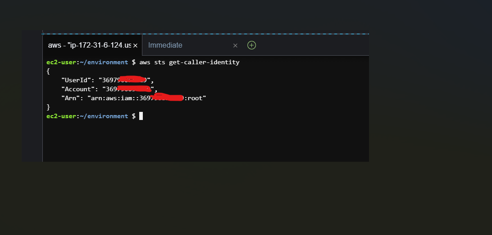

## WILD RYDES WORKSHOP

In this workshop, you'll deploy a web application that allows users to request unicorn rides from the Wild Rydes fleet. The application features an HTML-based user interface where users can specify their pick-up location. On the backend, it communicates with a RESTful web service to handle ride requests and dispatch unicorns. Users can also register and log in to request rides.

The application's architecture includes several AWS services:

- AWS Lambda: Executes backend logic for handling ride requests.

- Amazon API Gateway: Manages API requests from the frontend to the backend.

- Amazon S3: Stores static web resources such as HTML, CSS, JavaScript, and images.

- Amazon DynamoDB: Provides a database for storing data used by the Lambda functions.

- Amazon Cognito: Manages user registration, authentication, and access control for the backend API.

- AWS Amplify Console: Hosts the static web resources, serving them to users' browsers via S3. The JavaScript running in the browser interacts with the backend API.


__AWS CLOUD9 IDE__

AWS Cloud9 is a cloud-based integrated development environment (IDE) that you can use directly from your browser. It provides a code editor, debugger, and terminal, making it easy to write, run, and debug your code. Cloud9 comes with pre-installed tools for popular programming languages and the AWS Command Line Interface (CLI), so you don't need to install or configure anything on your laptop.

Your Cloud9 environment will have the same access to AWS resources as your AWS Management Console user. It's recommended to use Cloud9 for this workshop to ensure a seamless setup and integration with AWS services.

To get started, set up your Cloud9 environment now. Note that Cloud9 works best with Chrome or Firefox browsers and is not compatible with tablets or Safari.


__Starting AWS Cloud9__


- Go to the AWS Management Console, Select `Services` then select `Cloud9` under Developer Tools. From the top-right of the Console, select an available region for this workshop. Once you have selected a region for Cloud9, use the same region for the entirety of this workshop.


- Select `Create environment`.


- Enter `wildrydes-webapp-development` into Name and optionally provide a Description.


In Environment settings:

- Set the Instance type to t3.small (2 GiB RAM + 2 vCPU).

- Leave all other defaults unchanged.


- Review the environment settings and select `Create` environment. It will take a few minutes for your Cloud9 environment to be provisioned and prepared.


- Once ready, your IDE will open to a welcome screen. Below that, you should see a terminal prompt. Close the Welcome tab and drag up the terminal window to give yourself more space to work in.


- Keep your AWS Cloud9 IDE opened in a browser tab throughout this workshop.

- Verify that your user is logged in by running the command `aws sts get-caller-identity`. Copy and paste the command into the Cloud9 terminal window.


```
{
    "UserId": "369790854319",
    "Account": "369790854319",
    "Arn": "arn:aws:iam::369790854319:root"
}
```




__STATIC WEB HOSTING__

This section covers the frontend structure of your application. You will deploy a static website using AWS Amplify Console by first creating a Git repository (either in CodeCommit or GitHub) and then pushing your site code to it.

In this module, you will configure AWS Amplify Console to host the static resources (HTML, CSS, JavaScript, and images) for your web application. In the following modules, you will enhance these static pages with dynamic functionality by using JavaScript to interact with remote RESTful APIs built with AWS Lambda and Amazon API Gateway.

__Architecture Overview__

The architecture for this module is simple. All your static web content, such as HTML, CSS, JavaScript, images, and other files, will be managed by AWS Amplify Console and delivered through Amazon CloudFront. Users will access your site via the public URL provided by AWS Amplify Console. You don't need to manage any web servers or other services to make your site available.


__REGION__

This workshop step can be deployed in any AWS region that supports the following services:

- AWS Cognito

- AWS Amplify Console

- AWS CodeCommit


## REPOSITORY

__Create the git repository__

We will use [AWS CodeCommit](https://aws.amazon.com/codecommit/) to host your site’s repository. CodeCommit is included in the [AWS Free Tier](https://aws.amazon.com/free/?all-free-tier.sort-by=item.additionalFields.SortRank&all-free-tier.sort-order=asc&all-free-tier.q=CodeCommit&all-free-tier.q_operator=AND&awsf.Free%20Tier%20Types=*all&awsf.Free%20Tier%20Categories=*all).

__CodeCommit__ 

The AWS Cloud9 development environment provides AWS managed temporary credentials linked to your IAM user. These credentials are used with the [git-remote-codecommit tool](https://github.com/aws/git-remote-codecommit), which simplifies interactions with AWS CodeCommit. This tool is pre-installed in Cloud9. If you want to use it on your own machine, you can follow the [installation instructions](https://github.com/aws/git-remote-codecommit#set-up).


__Setting up your CodeCommit repository__

- First, create a new CodeCommit repository from within your Cloud9 terminal window:


`aws codecommit create-repository \ --repository-name wild-rydes`


- Clone the existing (not new) workshop repository from GitHub:

`git clone https://github.com/aws-samples/aws-serverless-webapp-workshop.git`


- Change into the workshop repository directory

`cd aws-serverless-webapp-`workshop`


- Install git-subtree if not already installed

`sudo yum install git-subtree -y`


- Split out the `WildRydesVue` code into its own branch

`git subtree split -P resources/code/WildRydesVue -b WildRydesVue`


- Create a new directory for your CodeCommit repository


`mkdir ../wild-rydes`

`cd ../wild-rydes`


- Initialize a new Git repository

`git init`


- Pull the `WildRydesVue` branch into your new repository


`git pull ../aws-serverless-webapp-workshop WildRydesVue`


- Add your CodeCommit repository as a remote


`git remote add origin codecommit://wild-rydes`


- Push the code to your new CodeCommit repository

`git push -u origin master`


- Remove the temporary local repository you created in step 2

`rm -rf ../aws-serverless-webapp-workshop`


## DEPLOY

__Deploy the site with AWS Amplify Console__

Next you’ll use the [AWS Amplify Console](https://aws.amazon.com/amplify/hosting/) to deploy the website you've committed to Git. The Amplify Console handles setting up storage for your static web application code and offers various features to simplify the application's lifecycle and promote best practices.

- Launch the [Amplify Console](https://us-west-1.console.aws.amazon.com/amplify/apps)


- Navigate to the AWS Management Console (https://console.aws.amazon.com/).

- In the top-left corner, click on "Services" and then select "Amplify" under "Mobile & Development" or search for "Amplify" in the search bar and select it.


- Connect a repository: Select __AWS CodeCommit__ and choose __Continue__

- From the drop down select the Repository and __master__ Branch created today and select __Next__

-  will detect that the application has an existing Amplify backend. Select __Create New Environment__ and name it __prod__.


__Create a New Service Role:__

- Go to the AWS Management Console and navigate to the IAM section.

- Click on "Create new role."

- Ensure "Amplify" is selected and click "Next: Permissions."

- Click "Next: Tags" without adding any tags.

- Click "Next: Review."

- Name the role `wildrydes-backend-role`.

- Click "Create role."

__Attach the AWSCodeCommitReadOnly Policy:__

- In the IAM console, search for __wildrydes-backend-role__ using the search filter.

- Click on the role name.

- Under the Add Permissions tab, click "Attach policies."

- Search for the `AWSCodeCommitReadOnly` policy.

- Check the box next to the policy name.

- Click "Attach Policy."

__Return to AWS Amplify Console:__

- Close the IAM tab and return to the AWS Amplify Console.

- Refresh the role list by clicking the circular arrow button.

- Select the `wildrydes-backend-role` from the refreshed list.

__Save and Deploy:__

- On the Review page in the Amplify Console, click "Save and deploy."

- The initial build and deploy process may take up to five minutes as Amplify Console sets up the necessary resources and deploys your code.


__Documentation of Failed Deployment on AWS Amplify Console__

I attempted to deploy the __wildrydes-webapp-development__ project using the AWS Amplify Console. Despite following the standard deployment process, the deployment failed.

__Troubleshooting__


- Steps Taken: Attempted to manually update the configuration files

- Reviewed amplify.yml, buildspec.yml, package.json etc


- Verified IAM roles and permissions

__Outcome__: Same error persisted

Despite my efforts, the build continues to fail with the same error. I am unsure if the issue is related to the environment configuration or a deeper issue with the project setup.

I am still working on resolving the issue and will update any progress.


